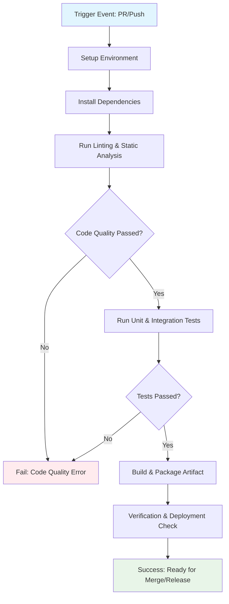

## Workflow Overview

**Purpose**: Automate the build, testing, and quality verification of the yt-download-cli project to ensure code integrity and functional correctness before deployment.
**Trigger Events**: Push events to feature branches, Pull Requests targeting main/master, and scheduled nightly runs.
**Target Environments**: Development (build/test), Production (release tagging/deployment checks).

## Execution Flow Diagram



## Jobs & Dependencies

| Job Name | Purpose | Dependencies | Execution Context |
|----------|---------|--------------|-------------------|
| setup-environment | Prepare the execution environment (Node.js, pnpm). | None | Node.js Runner |
| install-deps | Install all project dependencies using pnpm. | setup-environment | Node.js Runner |
| lint-code | Validate code style and detect potential errors. | install-deps | Node.js Runner |
| run-tests | Execute the Vitest suite for unit and integration tests. | lint-code | Node.js Runner |
| build-package | Compile TypeScript and generate the publishable tarball. | run-tests | Node.js Runner |
| deploy-check | Validate the publishable tarball integrity. | build-package | Shell Runner |

## Requirements Matrix

### Functional Requirements
| ID | Requirement | Priority | Acceptance Criteria |
|----|-------------|----------|-------------------|
| REQ-001 | Full test suite execution. | High | All Vitest tests must pass without failure. |
| REQ-002 | Successful compilation. | High | `pnpm build` must complete successfully, producing valid `dist/` files. |
| REQ-003 | Artifact verification. | High | `pnpm pack --dry-run` must execute without errors. |

### Security Requirements
| ID | Requirement | Implementation Constraint |
|----|-------------|---------------------------|
| SEC-001 | Secure dependency installation. | Dependencies must be fetched from trusted registries (e.g., npmjs). |
| SEC-002 | Secret handling. | All sensitive credentials must be passed via GitHub Secrets and never logged. |

### Performance Requirements
| ID | Metric | Target | Measurement Method |
|----|-------|--------|-------------------|
| PERF-001 | Test Suite Duration | Under 5 minutes | Measured by CI job run time. |
| PERF-002 | Build Time | Under 1 minute | Measured by CI job run time. |

## Input/Output Contracts

### Inputs

```yaml
# Repository Triggers
paths: [src/*] # Only trigger on changes to source code
branches: [main, master, develop] # Trigger on pushes to main/develop branches
```

### Outputs

```yaml
# Job Outputs
package_tarball: file # Description: The generated, verifiable publishable tarball.
```

### Secrets & Variables

| Type | Name | Purpose | Scope |
|------|------|---------|-------|
| Secret | NPM_TOKEN | Authentication for private package registry access. | Workflow |
| Variable | NODE_VERSION | Specifies the target Node.js runtime version. | Repository |

## Execution Constraints

### Runtime Constraints

- **Timeout**: 30 minutes (Max execution time per workflow run).
- **Concurrency**: Unlimited per branch, limited to 4 concurrent runs globally.
- **Resource Limits**: Standard GitHub-hosted runner configuration (sufficient for typical Node/TS workloads).

### Environmental Constraints

- **Runner Requirements**: Linux (Ubuntu) environment recommended for consistent `ffmpeg` interaction.
- **Network Access**: Must have outbound access to package registries and external services (e.g., YouTube APIs if needed).
- **Permissions**: Runner must have read access to the repository and permissions to run `pnpm` commands.

## Error Handling Strategy

| Error Type | Response | Recovery Action |
|------------|----------|-----------------|
| Build Failure | Fail Job | Notify maintainers and halt further deployment steps. |
| Test Failure | Fail Job | Halt the workflow; require code fix and re-run. |
| Deployment Failure | Fail Job | Log detailed error and trigger an automatic rollback notification if applicable. |

## Quality Gates

### Gate Definitions

| Gate | Criteria | Bypass Conditions |
|------|----------|-------------------|
| Code Quality | Linter must pass (no critical warnings). | N/A |
| Security Scan | No high-severity vulnerabilities detected in dependencies. | N/A |
| Test Coverage | Must meet minimum coverage threshold (e.g., 80% for core logic). | Must be explicitly approved by a maintainer. |

## Monitoring & Observability

### Key Metrics

- **Success Rate**: 99% (Long-term target)
- **Execution Time**: As per PERF-001.
- **Resource Usage**: Standard runner metrics provided by GitHub Actions.

### Alerting

| Condition | Severity | Notification Target |
|-----------|----------|-------------------|
| Failure | High | Team Slack Channel (#devops) |
| Test Coverage < 80% | Medium | Repository Maintainers |

## Integration Points

### External Systems

| System | Integration Type | Data Exchange | SLA Requirements |
|--------|------------------|---------------|------------------|
| NPM Registry | Package Publishing | Tarball/Artifacts | Immediate |

### Dependent Workflows

| Workflow | Relationship | Trigger Mechanism |
|----------|--------------|-------------------|
| Release Workflow | Dependency | Successful completion of this CI pipeline. |

## Compliance & Governance

### Audit Requirements

- **Execution Logs**: Retained for 90 days.
- **Approval Gates**: Required for merging into `main` if coverage is below 90%.
- **Change Control**: Changes to this workflow must be peer-reviewed and versioned in a separate PR.

### Security Controls

- **Access Control**: Read-only access for CI jobs to production data.
- **Secret Management**: Secrets rotation mandated quarterly.
- **Vulnerability Scanning**: Run on every dependency update.

## Edge Cases & Exceptions

### Scenario Matrix

| Scenario | Expected Behavior | Validation Method |
|----------|-------------------|-------------------|
| Empty Commit | Workflow should skip testing/building. | Test with an empty commit on a feature branch. |
| Dependency Network Failure | Job should fail gracefully, providing clear network error. | Simulate network failure during `pnpm install`. |

## Validation Criteria

### Workflow Validation

- **VLD-001**: The workflow must successfully build and test the entire application locally.
- **VLD-002**: The workflow must correctly identify and fail when any required test fails.

### Performance Benchmarks

- **PERF-001**: Test suite must execute within the defined time limit.
- **PERF-002**: Build time must be optimized using caching mechanisms.

## Change Management

### Update Process

1. **Specification Update**: Modify this document first.
2. **Review & Approval**: Submit PR targeting this specification file.
3. **Implementation**: Apply changes to workflow
4. **Testing**: Validate the new workflow behavior locally.
5. **Deployment**: Merge the specification and the workflow file.

### Version History

| Version | Date | Changes | Author |
|---------|------|---------|--------|
| 1.0 | 2026-04-20 | Initial specification for CI/CD pipeline. | AI Assistant |

## Related Specifications

- /spec/spec-process-cicd-add-id3-metadata-to-mp3-plan.md
- /spec/spec-process-cicd-add-mp3-output-format-plan.md